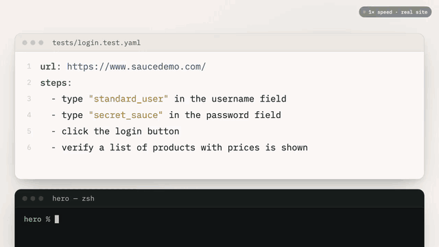

# Sedum

[](https://github.com/sedum-dev/sedum/actions/workflows/ci.yml)
[](https://codescene.io/projects/85416)
[](https://codescene.io/projects/85416)
[](https://www.npmjs.com/package/sedum-cli)
[](https://docs.sedum.dev/)
[](LICENSE)


Write browser tests in plain English, keep the full power of TypeScript, and
run the whole suite on every pull request for dollars a month instead of
thousands.



```ts
// tests/checkout.test.ts
import { faker } from "@faker-js/faker";
import { test, expect, secret } from "sedum-cli";

test(
  "a customer checks out",
  { url: "https://www.saucedemo.com/" },
  async ({ page, ai, env }) => {
    await ai.group(
      "Log in",
      [
        "type {{user}} in the username field",
        "type {{password}} in the password field",
        "click the login button",
      ],
      { user: "standard_user", password: secret(env.SAUCE_PASSWORD!) },
    );

    await ai("click the Add to cart button for {{product}}", {
      product: "Sauce Labs Backpack",
    });
    await expect(page.locator(".shopping_cart_badge")).toHaveText("1"); // plain Playwright

    await ai("click the shopping cart link");
    await ai("click the Checkout button");
    await ai("type {{first}} in the First Name field", {
      first: faker.person.firstName(),
    });
    await ai("type {{last}} in the Last Name field", {
      last: faker.person.lastName(),
    });
    await ai("type {{zip}} in the Zip/Postal Code field", {
      zip: faker.location.zipCode(),
    });
    await ai("click the Continue button");
    await ai("verify the order summary lists Sauce Labs Backpack");
  },
);
```

```sh
npx sedum run tests/checkout.test.ts
```

Each `ai(...)` sentence is one step that Sedum resolves on the page, with no
selectors. Everything between steps is ordinary code: Playwright's `page` and
`expect`, test data from any library, API calls to seed or skip setup, and
helper functions.

Sedum uses a decision model for bounded tasks such as finding the element a
sentence refers to and judging whether a claim holds on the page. TypeSafe Jev
is the default; Cloudflare Clef is an opt-in text provider. Both return
probabilities, not free text. Everything else is deterministic: clicking,
typing, waiting, verdicts, and exit codes run on Playwright.

> **Status: pre-alpha.** The first alpha is on npm as `sedum-cli`. The test
> format may change before 1.0, and Windows is experimental. Linux and macOS
> are verified.

## Quickstart

You need Node.js 20.19 or newer and credentials for TypeSafe (the default), a
compatible TypeSafe endpoint, or Cloudflare Clef.

```sh
mkdir my-sedum-tests && cd my-sedum-tests
npm init -y
git init                              # locator results are cached in Git metadata
npm install -D sedum-cli
npx sedum init                        # an example test, config, and .env.example
npx sedum browsers install chromium   # if init says it is missing
cp .env.example .env                  # then set TYPESAFE_API_KEY in .env
npx sedum run tests/example.test.ts --headed
```

For a compatible provider, set `TYPESAFE_BASE_URL` to its API root and
`TYPESAFE_API_KEY` to that provider's key. Set `TYPESAFE_DEFAULT_MODEL` if its
model name differs from the default. See
[provider configuration](https://docs.sedum.dev/configuration).

To use Cloudflare Workers AI instead, select `provider: {name: clef, model:
clef}` (or `clef-flash`) and set `CLOUDFLARE_ACCOUNT_ID` and
`CLOUDFLARE_AUTH_TOKEN`. See [Clef provider](https://docs.sedum.dev/provider-clef).

The example signs in to a demo shop. To see a failure, change its last step to
a false claim, such as `verify an error message says the password is incorrect`,
and run it again: it fails with exit code 1. If anything is missing,
`npx sedum doctor` says what and how to fix it.

New to AI browser tests? Read
[plain-English browser tests](https://docs.sedum.dev/plain-english-tests) first.

## Why Sedum

Writing tests in English is not new. Running them on every pull request is
usually too expensive, because hosted tools charge per step. Sedum is open
source, runs on your machine with your own key, and calls a model that is fast
and cheap enough to ask on every step.

|                                   | Per-step platform | Sedum on Jev           |
| --------------------------------- | ----------------- | ---------------------- |
| Monthly cost of a team's PR suite | $4,875            | $38–$91 (**53× less**) |
| 17-step checkout on saucedemo.com | 69 s              | 14 s (**4.9× faster**) |

The cost row is 50 tests of 10 steps (3 of them AI steps), run about 20 times a
day by a 20-person team, priced at a per-step platform's published
pay-as-you-go rates and at Jev's posted token price ($91 with the cache off).
The speed row is five runs each with every cache off, on one laptop. See
[sedum.dev](https://sedum.dev) for the full method.

How it compares with other ways to test in a browser:

|                         | Coded tests (Playwright, Cypress) | Browser agents      | Per-step AI platforms | Sedum |
| ----------------------- | --------------------------------- | ------------------- | --------------------- | ----- |
| Selectors to maintain   | Yes                               | No                  | No                    | No    |
| Same actions every run  | Yes                               | No, the agent picks | Yes                   | Yes   |
| Cost to run on every PR | Low                               | High                | High                  | Low   |
| Open source, your key   | Yes                               | Often               | No                    | Yes   |

- **Probabilities, not guesses.** Every claim is scored against a threshold you
  set, and checked for contradicting evidence. A marginal pass is flagged, not
  silently green. See [probabilistic testing](https://docs.sedum.dev/probabilistic-testing).
- **No black box.** Prompts, scoring, and caching are in this repo. You can see
  exactly what goes to the model and what comes back.

## Fix failures with your coding agent

When a test fails, have Sedum write a report for an agent such as Claude Code
or Cursor:

```sh
npx sedum run --reporter markdown
# markdown .sedum/runs/<run-id>/report.md
```

Then ask the agent to read that file and fix the failure. The report puts the
most urgent problem first, with the sentence and its file and line, the scores,
the page text the model judged, the elements it considered, a screenshot, and a
command to rerun just that test, so the agent can check its own fix. Page text
is fenced and labelled untrusted, so a page cannot inject instructions into the
report.

## Writing tests

A test is a `test()` in a `*.test.ts` file. Its body gets `ai` for
plain-English steps, and Playwright's `page` and `context` for everything else.

| You write                                                        | Sedum does                            |
| ---------------------------------------------------------------- | ------------------------------------- |
| `await ai("click the Checkout button")`                          | finds the button and clicks it        |
| `await ai("type {{zip}} in the Zip/Postal Code field", { zip })` | types the value you pass              |
| `await ai("verify the order summary lists 2 items")`             | judges the claim against the page     |
| `await ai.extract("the order total")`                            | returns the element's text            |
| `await ai.group("Checkout", async () => { ... })`                | reports the steps inside under a name |

Write `{{name}}` in a sentence and pass the value separately, so the sentence
stays the same on every run and can be checked before a run. Wrap passwords
and tokens in `secret()`: they are typed, but never sent to the model or shown
in reports. A file can hold several tests, and each gets a fresh browser
context. See [TypeScript tests](https://docs.sedum.dev/typescript-tests) for the full API, and
[examples/saucedemo](examples/saucedemo) for a small suite that uses faker,
skips the login form with a cookie, and checks app state behind the UI.

### YAML tests

Tests that need no code can also be `*.test.yaml` files with a list of
sentences. Both formats run side by side in one project.

```yaml
# tests/login.test.yaml
url: https://www.saucedemo.com/
data:
  user: standard_user
  password: $SAUCE_PASSWORD
steps:
  - type {{user}} in the username field
  - type {{password}} in the password field
  - click the login button
  - verify a list of products with prices is shown
```

`$VAR` reads an environment variable and is treated as a secret. Put shared
steps in a `*.module.yaml` file and call it with `use:`. See the
[YAML format](https://docs.sedum.dev/format).

## Learn more

- [TypeScript tests](https://docs.sedum.dev/typescript-tests): `test()`, `ai`, values and
  secrets, groups, `extract`, Playwright between steps, and results.
- [YAML format](https://docs.sedum.dev/format): data, secrets, modules, `before` and `after`
  steps, ids, and tags.
- [CLI commands](https://docs.sedum.dev/cli): filters, parallel runs and sharding, retries,
  timeouts, reporters, and exit codes.
- [Running in CI](https://docs.sedum.dev/ci): GitHub Actions, GitLab, and Jenkins, with JUnit
  and job summaries.
- [Project configuration](https://docs.sedum.dev/configuration): `sedum.config.yaml`,
  environments, thresholds, and `.env`.
- [Probabilistic testing](https://docs.sedum.dev/probabilistic-testing): how scores become
  verdicts, flags, and exit codes.
- [Provider privacy](https://docs.sedum.dev/provider-typesafe): what bounded data is sent to
  the default provider, and what is excluded.
- [Clef provider](https://docs.sedum.dev/provider-clef): Cloudflare setup, models, pricing,
  privacy, and current text-only scope.
- [All documentation](https://docs.sedum.dev/)

## Coming next

Recently shipped: tests in TypeScript, the first alpha on npm, `sedum init` to
scaffold a project, parallel runs and sharding, and JUnit reports.

Planned for the 0.1 alpha:

- a GitHub Action
- starting your app before a run

## Goal-based tests

State the outcome and let Sedum work out the actions, then independently verify it:

```yaml
url: https://shop.example.com/
goal: >
  sign in, add a hat to the cart, check out with the saved card
verify: the confirmation page shows an order number
```

Goal tests are YAML only for now. Use `goal` and a required `verify` claim instead of `steps`. Supply typing values
through `data`; `before` and `after` hooks remain available. Run and validate the
file with the same CLI commands as authored-step tests. See [goal mode](https://docs.sedum.dev/goal-mode)
for budgets, reporting, supported operations and recorded limitations.

## Contributing

Issues and pull requests are welcome. See [CONTRIBUTING.md](CONTRIBUTING.md)
to build from source, and [SECURITY.md](SECURITY.md) to report a
vulnerability. Sedum is [MIT licensed](LICENSE).
